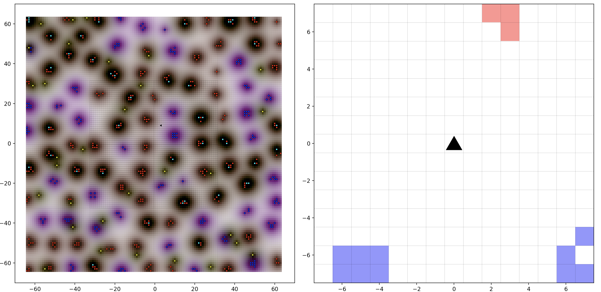

# COMP579 Project Template
## Virtual Environment
Create a virtual environment with the dependencies found in `environment.yml`. 

```
git clone https://github.com/COMP579TA/COMP579-Project-Template
cd COMP579-Project-Template
conda env create environment.yml -n my-venv
conda activate my-venv
```

Note that this environment contains a cudatoolkit of version 10.2.89. Thus, you may have to uninstall and then reinstall it depending on your cuda version in the case that you are using GPUs. 


## Training the agent
Run `python3 train_agent.py --save_weights`. For more information about the command line arguments, run `python3 train_agent.py -h`.

## Evaluating the agent
Run `python3 eval_agent.py --pretrain`. For more information about the command line arguments, run `python3 eval_agent.py -h`.


## Domain: Jellybean world
<p align="center">
  
</p>

### Environment description
[Jelly bean world](https://arxiv.org/pdf/2002.06306.pdf) is a testbed that provides infinite 2D gridworlds with objects in it to test continual learning agents. For this project, you are given a custom jelly bean environment which has 4 different kinds of objects - Apples, Bananas, Jelly beans, and Truffles. These objects are distributed throughout the grid according to an unknown probability distribution. Some of these objects appear together, for instance, Apples and Truffles are always together. Some objects appear in clusters, for example, Apples and Jelly beans appear in seperate clusters, while some objects, like bananas, are uniformly distributed. Although the original aim of this environment is to train a continual learning RL agent (an RL agent that continually learns in the changing world) in an infinite world, for simplicity, you will be working in a traditional episodic setting. Each episode has `5000` timesteps in this task and your job is to train an RL agent that can gather as many rewards as it can in an episode. Rewards are obtained by collecting various objects in the environment:

|**Object**|**Reward**|
| ----------- | ----------- |
|Apple|+1.0|
|Banana|+0.1|
|Jelly bean|-1.0|
|Truffle|-0.1|

The environment provides several kinds of information to the agent that form an observation space - scent, vision, and features.
- **Scent**: Each object has different kinds of scent that is diffused throughout the grid:

|**Object**|**Scent**|
| ----------- | ----------- |
|Apple|[1.64, 0.54, 0.4]|
|Banana|[1.92, 1.76, 0.4]|
|Jelly bean|[0.68, 0.01, 0.99]|
|Truffle|[8.4, 4.8, 2.6]|

At any point in time, agent can perceive scent at its location (vector of size 3), which is a mixture of scents diffused from various objects and nearby cells.

- **Vision**: Agent can observe its surroundings as a 15x15 RGB image, where different objects have different colours.

- **Features**: While working with vision directly is interesting, it could be challenging due to computation limiations. So, we provide you with features to train your agent. Feature vector is a binary vector of length `15x15x4 (900)`, where the first `15x15 (225)` elements indicate the presence of the first object, the next `225` bits indicate the presence of the second object, and so on.
Each part of the observation space is complementary to the other and you are free to use any combinations of these spaces to train your agent. You can also work with just features like the *TA-basic agent* (peforms some operations on features). Note that none of these elements provides full information of the world at a given point in time. So, you might have to construct a state to train your agent.

The agents action space consists of *4 actions* which moves the agent in one of the *4 natural directions (North, East, West, and South)*.

### Installation
#### Requirements

`GCC 4.9+, Clang 5+, or Visual C++ 14+`

`python >= 3.5, gym >= 0.22.0, numpy, matplotlib, scikit-image >= 0.19.2, scikit-learn >= 1.0.2, scipy >= 1.8.0, torch >= 1.10.1, torchvision >= 0.10.0`

#### Setup JBW
You can do the following installation without hassle if you have configured your system to establish `ssh` connection with github (https://docs.github.com/en/authentication/connecting-to-github-with-ssh/about-ssh). Otherwise, you will have to use `https` links to work with git.

1. After installing the requirements, clone the [JBW repo](https://github.com/NishanthVAnand/jelly-bean-world):
`git clone git@github.com:NishanthVAnand/jelly-bean-world.git`

2. Install the Jbw repo:
```
cd jelly-bean-world
git submodule update --init --recursive
cd api/python
python setup.py install
```

Mac M1 users will use `setup_m1.py` instead. You are required to run `git submodule update --init --recursive` only the first time and subsequently you will run `git submodule update --remote` instead, which pulls the latest dependencies required for the Jbw package. For some of you working *without* ssh connection, the above commands might not work. In that case run:

```
cd jelly-bean-world

rm -rf jbw/deps/core
git rm jbw/deps/core
git submodule add https://github.com/asaparov/core.git jbw/deps/core

rm -rf jbw/deps/math
git rm jbw/deps/math
git submodule add https://github.com/asaparov/math.git jbw/deps/math

cd api/python
python setup.py install
```
Subsequently, you can use `git submodule update --remote`.

3. Testing:
Jbw must have installed now. You can test it by running the below code in a python interpreter.

``` python
import jbw
import gym

env = gym.make("JBW-COMP579-obj-v1")
curr_obs = env.reset()
```
